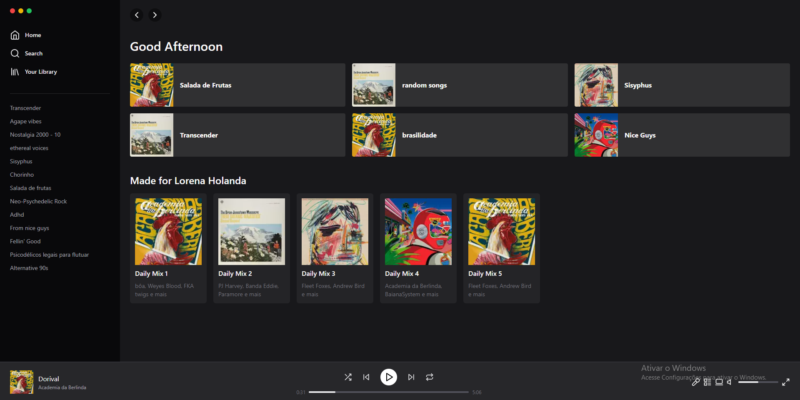

# ⏪ ▶ ⏩ [Spotify UI Clone](https://github.com/lrnholanda/spotify-clone)

 
### Links

- Website URL: [Click here] it's still not working

## My process

### Built with

- Semantic HTML5 markup
- Tailwind custom properties
- Flexbox
- CSS Grid
- TypeScript

### What I learned

I learned a lot with this project, for example I learned to use tailwind properties...

### Useful resources

- ["Share on Twitter" Button](https://nextjs.org/docs/basic-features/typescript)

## Author

- GitHub - [@lrnholanda](https://github.com/lrnholanda)
- Twitter - [@lrnhola](https://twitter.com/lrnhola)
